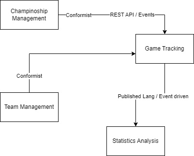

# Структура работы (DDD-документация)

## 1. Описание предметной области

**Проблема**

Система предназначена для учета статистики волейбольных матчей в рамках чемпионатов. Она позволяет организовывать чемпионаты, команды и игры, а также в реальном времени собирать детальную статистику действий игроков в матчах.

**Бизнес-процессы**

- Регистрация чемпионатов, раундов, команд, игроков.
- Организация расписания матчей.
- Запись результатов сетов и действий игроков в реальном времени.
- Фиксация побед, подсчет очков.
- Просмотр статистики по игрокам, матчам и чемпионатам.

## 2. Определение основных сущностей

Ключевые сущности:

| Сущность                                | Атрибуты                                          | Поведение                                    |
| --------------------------------------- | ------------------------------------------------- | -------------------------------------------- |
| `Championship`                            | `title`, `start_date`, `end_date`                 | Создание чемпионата, добавление раундов      |
| `Round`                                   | `serial_number`, `start_date`, `end_date`         | Добавление матчей в раунде                   |
| `Game`                                    | `team_id`, `opp_team_id`, `date`, `win`           | Установка участников, результат, запуск игры |
| `Team`                                    | `name`, `user_id` (тренер)                        | Регистрация, добавление игроков              |
| `Player`                                  | `first_name`, `last_name`, `team_id`, `amplua_id` | Запись действий, принадлежность команде      |  | Запись действий, принадлежность команде |
| `Set`                                     | `team_score`, `opp_score`                         | Подсчет очков в рамках игры                  |
| `SetAction`                               | `player_id`, `action_rate_id`                     | Фиксация действия игрока в сете              |

## 3. Определение агрегатов и границ консистентности

### Агрегаты

**Championship**

    Содержит: Rounds, Games

    Примечание: изменения в расписании не должны влиять на другие части системы

**Team**

    Содержит: Players, связь с User (тренер)

    Примечание: состав игроков и тренер редактируются централизованно

**Game**

    Содержит: Sets, GamePlayers, SetActions

    Примечание: статистика матча должна быть строго консистентной

**Где важна строгая консистентность:**

    Внутри Game —  при записи действий в реальном времени

    Внутри Team — при регистрации игроков

    Между Game и Set — результат сета влияет на результат игры

## 4. Разделение на контексты (Bounded Contexts)

| Контекст                | Ответственность                                                   |
| ----------------------- | ----------------------------------------------------------------- |
| `Championship Management` | Создание чемпионатов, раундов, организация матчей                 |
| `Team Management`         | Регистрация команд, тренеров, игроков                             |
| `Game Tracking`           | Проведение матча, запись статистики, подсчет очков                |
| `Statistics Analysis`   | Формирование аналитики по действиям, эффективности игроков и т.д. |

**Взаимодействие:**

    Championship Management -> сообщает Game Tracking, какие игры нужно провести

    Team Management -> предоставляет игроков для записи статистики

    Game Tracking -> генерирует данные для Statistics Analysis

## 5. Диаграмма связей сущностей

**ER**

User (1) -- (N) Team  
Team (1) -- (N) Player  
Player (N) -- (1) Amplua  

Championship (1) -- (N) Round  
Round (1) -- (N) Game  

Team (1) -- (N) Game      (как team_id)  
Team (1) -- (N) Game      (как opp_team_id)  

Game (1) -- (N) GamePlayer  
Player (1) -- (N) GamePlayer  

Game (1) -- (N) Set  
Set (1) -- (N) SetAction  
Player (1) -- (N) SetAction  

Action (1) -- (N) ActionRate  
ActionRate (1) -- (N) SetAction  

## 6. Описание взаимодействия контекстов

**Механизмы:**

    REST API — для командной работы модулей

    События (Event Bus / Domain Events) — например, MatchEndedEvent для триггера анализа

    Сервисные интерфейсы — GameStatsService, TeamRosterService

**Примеры передаваемых данных:**

    Team Management → Game Tracking: список игроков для матча

    Game Tracking → Statistics: статистика по действиям

    Championship → Game Tracking: данные о запланированных матчах

## 7. Примеры доменных сценариев

### Сценарий 1: Проведение матча

    Вводится игра из круга

    Старт матча

    В реальном времени записываются SetActions и ведется счет

    Сохраняется результат игры

**Контексты:** Championship ➝ Game Tracking

### Сценарий 2: Регистрация команды

    Тренер (user) регистрирует команду

    Добавляет игроков и их роли

    Команда появляется в чемпионате

**Контексты:** Team Management ➝ Championship Management

### Сценарий 3: Анализ эффективности

    После завершения игры генерируются отчеты

    Статистика по действиям игрока

    Используется для формирования отчета

**Контексты:** Game Tracking ➝ Statistics

## 8. Описание доменных сервисов

| Сервис                  | Задача                                                  |
| ----------------------- | ------------------------------------------------------- |
| `MatchStatsRecorder`      | Реализация логики записи действий игроков в рамках игры |
| `GameResultService`       | Подсчет победителя на основе сетов                      |
| `TeamRegistrationService` | Создание команды, добавление тренера и игроков          |
| `ScheduleService`         | Генерация расписания игр по раундам                     |

**Где логика, а где CRUD:**

    MatchStatsRecorder, GameResultService — чистая доменная логика

    Team, Player — CRUD-операции, но могут оборачиваться в сервисы